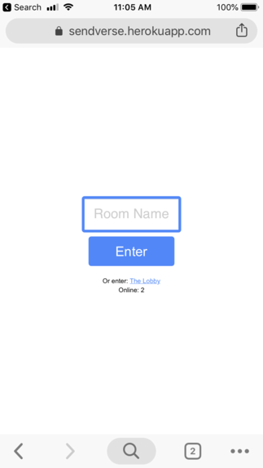
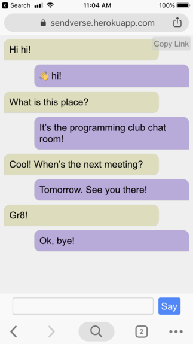

# Sendverse
An anonymous chatting server you can deploy for your friends.
See it in action:
http://sendverse.herokuapp.com/

#### The software
This repo includes the server side and frontend software required to run your own chatting app. The software is written in javascript. It uses Express.js to serve files, and socket.io, for the the realtime communication between the server and client.




##### Contents
In this repo, you will find the server-side software, *app.js*, and the frontend, deployable software, located in the *public* directory. The frontend src files are located in the *src* directory.

#### Deploy your own
*To clone this repo:*
``` bash
    git clone https://github.com/liam-ilan/sendverse.git
```

##### Running the app
*To start up a local server on port 3000:*
``` bash
    npm start
```
*(or push to Heroku)*

#### Development 
*Start up a localhost on port 3000 for development with Nodemon and Webpack:*

``` bash
    npm run dev
```

*Lint javascript:*
``` bash
    npm run lint
```

#### Author
I'm Liam Ilan, a 13 year old software developer who is never working, but always playing around.